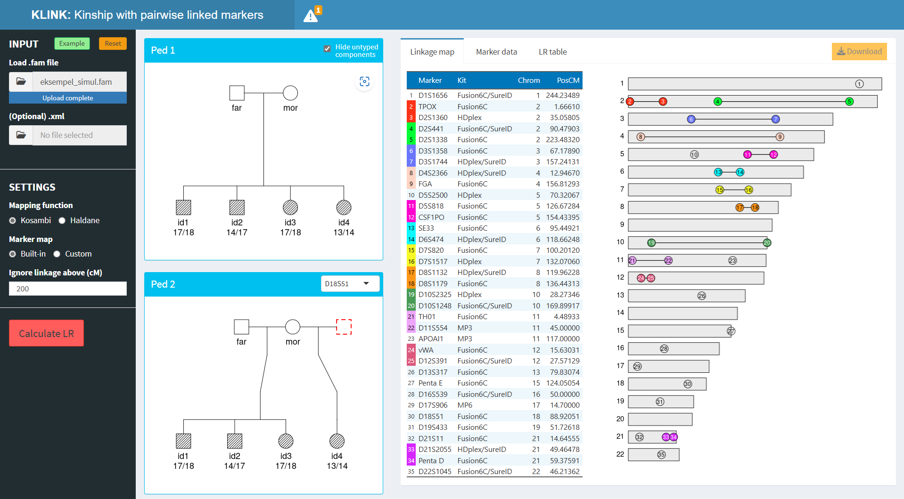

<!-- README.md is generated from README.Rmd. Please edit that file -->

# KLINK

<!-- badges: start -->

[](https://CRAN.R-project.org/package=KLINK)
[](https://cran.r-project.org/package=KLINK)
[](https://cran.r-project.org/package=KLINK)
<!-- badges: end -->

KLINK is a shiny application for LR calculations in forensic kinship
testing.

Live app here: <https://magnusdv.shinyapps.io/klink/>

## Running KLINK locally

If you are working with sensitive data, you might want to run KLINK
locally/offline. To set this up, first install the KLINK package in R:

``` r
install.packages("KLINK")
```

Then you may start KLINK as follows:

``` r
KLINK::launchApp()
```


